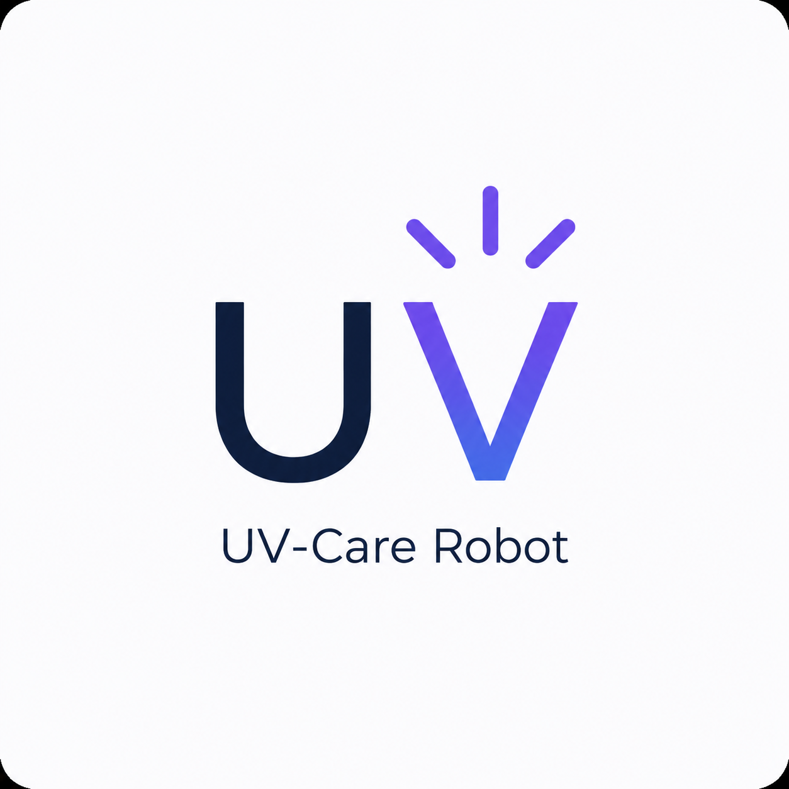
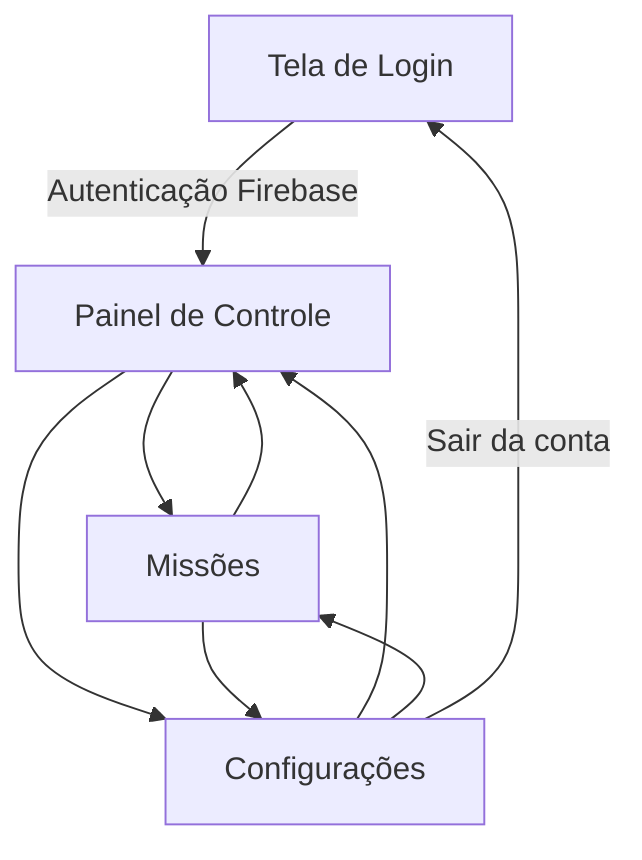

# 🤖 UV-Care Robot

<p align="center">
  
</p>

<p align="center">
  Aplicativo Android para interface de controle e gerenciamento de um protótipo de robô de desinfecção UV-C.
</p>

<p align="center">
  
  
  
  
</p>

<p align="center">
  <a href="https://github.com/IgorGabriel505/UV-Care-Robot/releases/latest">
    
  </a>
  <a href="https://github.com/IgorGabriel505/UV-Care-Robot">
    
  </a>
</p>

> **Status:** protótipo em desenvolvimento. A interface, autenticação e navegação estão implementadas. Os comandos do painel atualmente alteram o estado local da aplicação; a comunicação física com o robô ainda não faz parte desta versão do código.

---

## 📖 Sobre o projeto

O **UV-Care Robot** é um aplicativo Android desenvolvido para servir como interface de controle de um robô voltado à desinfecção de ambientes com tecnologia UV-C.

A aplicação concentra funções de autenticação, visualização do estado do robô, controles operacionais, gerenciamento de missões e configurações de usuário em uma interface pensada para um cenário hospitalar.

O projeto foi desenvolvido com foco em **Java para Android**, interfaces em **XML** e autenticação por meio do **Firebase Authentication**.

---

## ✨ Funcionalidades

- 🔐 Login de usuários com Firebase Authentication
- 💾 Opção **Lembrar login** utilizando `SharedPreferences`
- 🏠 Painel principal de controle do robô
- ⚡ Controle de ligar/desligar o estado do robô na interface
- 🛑 Parada segura
- 🔙 Comando de retorno à base
- 🔋 Visualização de bateria, localização, conexão e estado UV-C
- 🎯 Tela de gerenciamento de missões
- ☰ Menu lateral de navegação
- ⚙️ Tela de configurações
- 🚪 Logout com limpeza da sessão

### Em desenvolvimento

- Criação de novas missões
- Comunicação real entre aplicativo e robô
- Atualização de telemetria em tempo real
- Integração dos controles da interface com o hardware
- Expansão das rotinas de segurança UV-C

---

## 📱 Demonstração

### Login

<p align="center">
  
</p>

### Painel de controle

<p align="center">
  
  
</p>

### Missões e configurações

<p align="center">
  
  
</p>

> Adicione as capturas de tela em `docs/screenshots/` usando exatamente os nomes acima.

### Vídeo/GIF

Um GIF curto mostrando o fluxo **Login → Painel → Missões → Configurações** pode ser colocado em:

`docs/demo/uv-care-demo.gif`

Depois, substitua este texto por:

```html
<p align="center">
  
</p>
```

---

## 🧭 Fluxo da aplicação



---

## 🧩 Estrutura principal

```text
UV-Care-Robot/
├── app/
│   └── src/main/
│       ├── java/com/example/uv_carerobot/
│       │   ├── Tela_Login.java
│       │   ├── MainActivity.java
│       │   ├── Tela_Missoes.java
│       │   └── Tela_Configuracoes.java
│       ├── res/
│       │   ├── drawable/
│       │   ├── layout/
│       │   ├── mipmap-*/
│       │   └── values/
│       └── AndroidManifest.xml
├── docs/
│   ├── screenshots/
│   └── demo/
├── gradle/
├── build.gradle.kts
├── settings.gradle.kts
└── README.md
```

---

## 🛠️ Tecnologias utilizadas

| Tecnologia | Uso no projeto |
|---|---|
| **Java 11** | Lógica e comportamento das telas Android |
| **XML** | Construção das interfaces |
| **Android SDK** | Plataforma do aplicativo |
| **Firebase Authentication** | Autenticação de usuários |
| **SharedPreferences** | Persistência da opção de manter login |
| **Gradle Kotlin DSL** | Configuração e dependências do projeto |
| **Git / GitHub** | Versionamento e distribuição do código |

### Configuração Android

- `minSdk`: **24** — Android 7.0+
- `targetSdk`: **37**
- `compileSdk`: **37**
- Versão do aplicativo: **1.0**

---

## 🔐 Autenticação

A autenticação é realizada com **Firebase Authentication** utilizando e-mail e senha.

Quando a opção **Lembrar login** está habilitada, o aplicativo utiliza `SharedPreferences` para decidir se deve aproveitar uma sessão válida do Firebase na próxima abertura.

Para uma demonstração pública do projeto, recomenda-se utilizar um ambiente Firebase separado para testes ou implementar um **modo demonstração**, evitando compartilhar contas ou credenciais pessoais. O arquivo `google-services.json` não faz parte desta versão pública preparada do repositório; cada desenvolvedor pode adicionar sua própria configuração em `app/`.

---

## ▶️ Como executar pelo código-fonte

### Pré-requisitos

- Android Studio compatível com o projeto
- JDK compatível com a versão do Android Gradle Plugin utilizada
- Android SDK instalado
- Dispositivo Android ou emulador
- Projeto Firebase configurado para autenticação por e-mail/senha

### Passos

1. Clone o repositório:

```bash
git clone https://github.com/IgorGabriel505/UV-Care-Robot.git
```

2. Abra a pasta do projeto no **Android Studio**.
3. Aguarde a sincronização do Gradle.
4. Crie/configure seu próprio projeto Firebase e adicione o arquivo `google-services.json` dentro de `app/`.
5. Ative o provedor **E-mail/Senha** no Firebase Authentication.
6. Execute o aplicativo em um emulador ou dispositivo Android.

---

## 📦 Baixar e testar o APK

A forma recomendada de disponibilizar uma versão instalável é através de **GitHub Releases**, e não armazenando o APK diretamente na branch principal.

Quando uma versão estiver publicada, utilize:

👉 **[Baixar a versão mais recente](https://github.com/IgorGabriel505/UV-Care-Robot/releases/latest)**

Para testar a versão atual, o usuário também precisa ter acesso a uma conta de demonstração válida no Firebase, enquanto um modo de demonstração sem login não estiver implementado.

---

## 🧪 Estado atual do projeto

| Recurso | Estado |
|---|---|
| Login Firebase | ✅ Implementado |
| Lembrar login | ✅ Implementado |
| Navegação entre telas | ✅ Implementado |
| Painel de controle | ✅ Interface implementada |
| Parada segura | ✅ Estado local implementado |
| Retornar à base | ✅ Estado local implementado |
| Tela de missões | ✅ Interface implementada |
| Criar nova missão | 🚧 Planejado |
| Comunicação física com o robô | 🚧 Planejado |
| Telemetria em tempo real | 🚧 Planejado |

---

## 🗺️ Próximos passos

- [ ] Implementar criação e edição de missões
- [ ] Integrar comunicação real com o robô
- [ ] Receber telemetria e bateria em tempo real
- [ ] Integrar sensores e rotinas de segurança
- [ ] Criar modo de demonstração para o portfólio
- [ ] Adicionar testes para as principais regras da aplicação
- [ ] Melhorar tratamento de estados de conexão e falhas

---

## ⚠️ Segurança UV-C

Este projeto é um **protótipo acadêmico/de desenvolvimento**. Sistemas UV-C podem representar riscos à saúde quando utilizados de forma inadequada. Uma implementação física real deve possuir mecanismos independentes de segurança, sensores, intertravamentos e procedimentos adequados ao ambiente de operação.

---

## 👨‍💻 Autor

**Igor Gabriel**

- GitHub: [IgorGabriel505](https://github.com/IgorGabriel505)
- LinkedIn: [Igor Gabriel](https://www.linkedin.com/in/igor-gabriel-porto-vidal/)

---

<p align="center">
  Desenvolvido como projeto de estudo e evolução em desenvolvimento Android, Java e integração de software com robótica.
</p>
