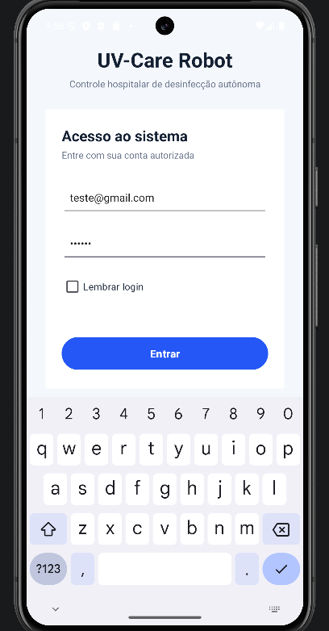
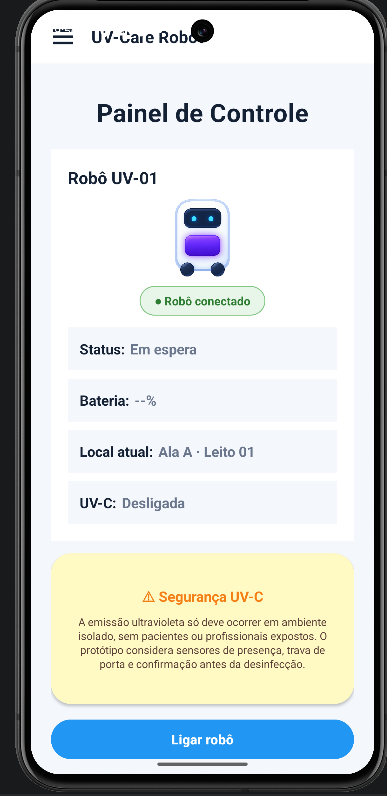
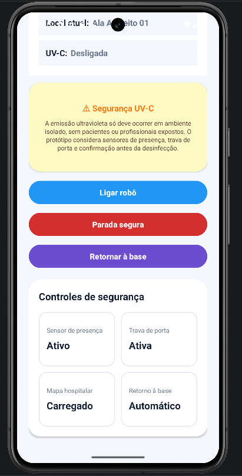
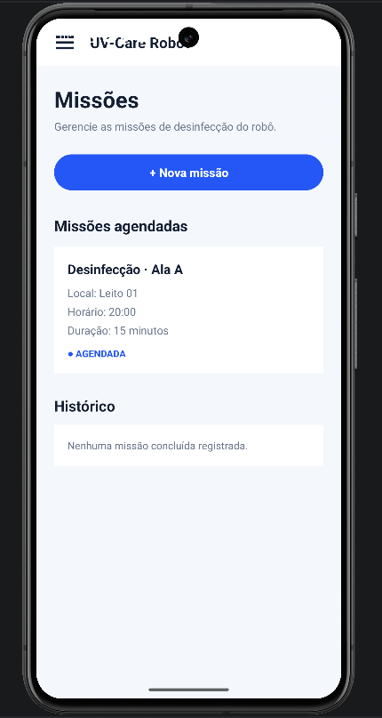
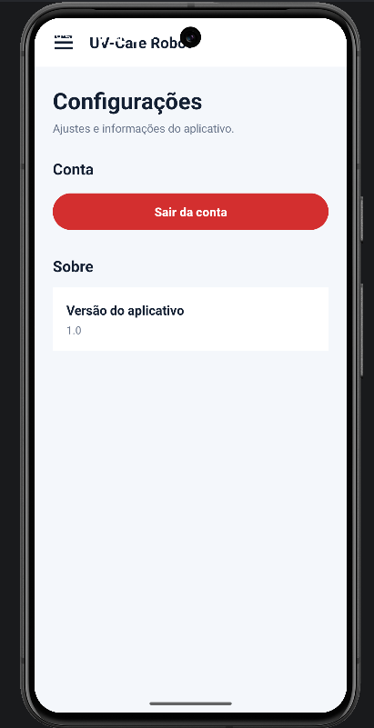

<div align="center">

# 🤖 UV-Care Robot

### Aplicativo Android para monitoramento e controle de um sistema de desinfecção UV

<p>
  
  
  
</p>

<p>
  <a href="https://github.com/IgorGabriel505/UV-Care-Robot">
    
  </a>

  <a href="https://www.linkedin.com/in/igor-gabriel-porto-vidal/">
    
  </a>
</p>

</div>

---

## 📖 Sobre o projeto

O **UV-Care Robot** é um aplicativo Android desenvolvido em **Java** como protótipo demonstrativo para apresentação na **FETIN**.

A aplicação representa uma interface de monitoramento e controle para um sistema de desinfecção utilizando luz UV, permitindo ao usuário visualizar informações relacionadas ao estado do robô, executar comandos pela interface e acompanhar missões.

O objetivo do projeto foi demonstrar, de maneira visual e interativa, como um aplicativo Android pode ser utilizado como interface de operação de um sistema robótico.

> O aplicativo possui caráter demonstrativo. As funcionalidades apresentadas representam os fluxos e controles desenvolvidos para a demonstração do sistema UV-Care Robot.

---

## 🏫 Contexto do projeto

O **UV-Care Robot** foi desenvolvido com foco em demonstração durante a **FETIN**, permitindo apresentar de forma prática a interação entre o usuário e a proposta do sistema robótico.

O aplicativo funciona como a camada visual do projeto, centralizando informações, controles e navegação em uma interface Android criada especificamente para a apresentação.

---

## 🎯 Objetivo

O projeto foi desenvolvido para apresentar uma solução capaz de centralizar a interação entre o usuário e o sistema UV-Care Robot.

Por meio do aplicativo é possível demonstrar:

- 🔐 Autenticação de usuários
- 🤖 Monitoramento do estado do robô
- 🔋 Visualização do nível de bateria
- 📍 Indicação de localização
- ☀️ Estado do sistema UV
- 📡 Estado da conexão
- 🔌 Ativação do robô
- 🛑 Parada segura
- 📋 Visualização de missões
- ⚙️ Configurações
- ☰ Navegação por menu lateral

---

## 📱 Interface do aplicativo

### 🔐 Login

<div align="center">



</div>

Tela responsável pela autenticação do usuário utilizando **Firebase Authentication**.

A interface também possui a opção **Lembrar login**, permitindo manter a sessão do usuário salva.

---

### 🤖 Painel principal

<div align="center">



</div>

O painel principal concentra as principais informações relacionadas ao funcionamento do sistema.

Entre as informações apresentadas estão:

- Status do robô
- Estado da bateria
- Localização
- Estado do sistema UV
- Estado da conexão

A tela também possui os principais controles utilizados durante a demonstração.

---

### 🎛️ Controles do sistema

<div align="center">



</div>

Visualização complementar do painel demonstrando os controles e informações disponíveis durante a operação do sistema.

---

### 📋 Missões

<div align="center">



</div>

Tela responsável pela visualização das missões relacionadas ao funcionamento do sistema durante a demonstração.

---

### ⚙️ Configurações

<div align="center">



</div>

Área destinada às configurações da aplicação e ao gerenciamento da sessão do usuário.

---

## ⚙️ Funcionalidades

| Funcionalidade | Status |
|---|:---:|
| 🔐 Login com Firebase Authentication | ✅ |
| 💾 Lembrar login | ✅ |
| 🤖 Painel de monitoramento | ✅ |
| 🔌 Ativação do robô pela interface | ✅ |
| 🛑 Parada segura | ✅ |
| 🔋 Visualização da bateria | ✅ |
| 📍 Visualização da localização | ✅ |
| ☀️ Estado do sistema UV | ✅ |
| 📡 Estado da conexão | ✅ |
| 📋 Tela de missões | ✅ |
| ☰ Menu lateral | ✅ |
| ⚙️ Configurações | ✅ |
| 🚪 Logout | ✅ |

---

## 🧪 Conta de demonstração

Para facilitar a avaliação e os testes do aplicativo, foi criada uma conta exclusivamente para demonstração.

**E-mail:** `teste@gmail.com`  
**Senha:** `123456`

> Esta conta foi criada exclusivamente para permitir o acesso às funcionalidades demonstrativas do projeto.

---

## 🚀 Tecnologias utilizadas

### 💻 Desenvolvimento

<p>
  
  
</p>

**Java** · **Android Studio** · **XML**

---

### 🔥 Autenticação

<p>
  
</p>

O **Firebase Authentication** é utilizado para realizar a autenticação dos usuários no aplicativo.

---

### 🛠️ Versionamento

<p>
  
</p>

**Git** · **GitHub**

---

## 🧩 Estrutura da aplicação

```text
Tela_Login
     │
     ▼
Firebase Authentication
     │
     ▼
MainActivity
     │
     ├──────────────► Painel principal
     │
     ├──────────────► Monitoramento
     │
     ├──────────────► Controles
     │
     ├──────────────► Tela_Missoes
     │
     └──────────────► Tela_Configuracoes
                            │
                            ▼
                          Logout
```

---

## 📦 Principais classes

### `Tela_Login.java`

Responsável pela autenticação do usuário através do Firebase e pelo gerenciamento inicial da sessão.

### `MainActivity.java`

Responsável pelo painel principal, pelas informações de estado e pelos controles apresentados ao usuário.

### `Tela_Missoes.java`

Responsável pela interface relacionada às missões do sistema.

### `Tela_Configuracoes.java`

Responsável pelas configurações da aplicação e pelo logout do usuário.

---

## 📂 Estrutura do repositório

```text
UV-Care-Robot/
│
├── app/
│   ├── src/
│   │   └── main/
│   │       ├── java/
│   │       │   └── com/example/uv_carerobot/
│   │       │       ├── Tela_Login.java
│   │       │       ├── MainActivity.java
│   │       │       ├── Tela_Missoes.java
│   │       │       └── Tela_Configuracoes.java
│   │       │
│   │       ├── res/
│   │       │   ├── drawable/
│   │       │   ├── layout/
│   │       │   ├── menu/
│   │       │   ├── mipmap/
│   │       │   └── values/
│   │       │
│   │       └── AndroidManifest.xml
│   │
│   └── build.gradle.kts
│
├── docs/
│   ├── screenshots/
│   │   ├── painel_controle.png.png
│   │   ├── painel_controle2.png.png
│   │   ├── tela_configuracao.png.png
│   │   ├── tela_login.png.png
│   │   └── tela_missao.png.png
│   │
│   └── demo/
│
├── gradle/
├── .gitignore
├── LICENSE
├── README.md
├── build.gradle.kts
├── gradle.properties
├── settings.gradle.kts
├── gradlew
└── gradlew.bat
```

---

## ▶️ Executando o projeto

### Pré-requisitos

Para executar o projeto através do código-fonte é necessário possuir:

- Android Studio
- Android SDK
- JDK compatível com o projeto
- Emulador Android ou dispositivo físico
- Configuração adequada do Firebase

---

### 📥 Clonar o repositório

```bash
git clone https://github.com/IgorGabriel505/UV-Care-Robot.git
```

Depois:

1. Abra o projeto no **Android Studio**
2. Aguarde a sincronização do Gradle
3. Configure o Firebase quando necessário
4. Selecione um emulador ou dispositivo Android
5. Execute o aplicativo

---

## 📲 Testar o aplicativo

Uma versão compilada do aplicativo pode ser disponibilizada através da seção **Releases** deste repositório.

<p>
  <a href="https://github.com/IgorGabriel505/UV-Care-Robot/releases">
    
  </a>
</p>

Após instalar o aplicativo, utilize a conta de demonstração:

**E-mail:** `teste@gmail.com`  
**Senha:** `123456`

---

## 📌 Status do projeto

<div align="center">


</div>

O aplicativo atingiu o escopo definido para sua utilização como **protótipo demonstrativo na FETIN**.

O objetivo deste repositório é preservar o código-fonte, documentar a solução desenvolvida e permitir que outras pessoas conheçam e testem a aplicação.

---

## 👨‍💻 Autor

### Igor Gabriel

Estudante de **Engenharia de Software no INATEL**, Técnico em **Desenvolvimento de Sistemas pelo SENAI** e bolsista de **Iniciação Científica**, com foco profissional em **desenvolvimento Back-end Java**.

<p>
  <a href="https://github.com/IgorGabriel505">
    
  </a>

  <a href="https://www.linkedin.com/in/igor-gabriel-porto-vidal/">
    
  </a>
</p>

---

## 📄 Licença

Este projeto está disponibilizado sob a **MIT License**.

Consulte o arquivo [`LICENSE`](LICENSE) para mais informações.

---

<div align="center">

## 🤖 UV-Care Robot

**Java • Android • Firebase • XML**

Protótipo demonstrativo desenvolvido para a **FETIN**.

</div>
